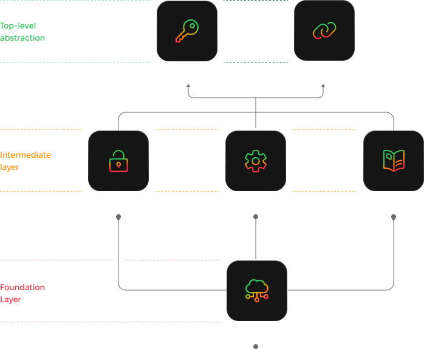

# 🌩️ What is ThunderStack?

## &#x20;ThunderStack Layered Architecture Overview

<figure><figcaption></figcaption></figure>

* **ThunderCloud**:\
  Cloud-based node management solution offering 24/7 availability, remote signing, and zero maintenance for enhanced reliability and security.
* **ThunderEngine**:\
  API-to-Cloud solution enabling seamless interaction with ThunderCloud services for efficient and scalable integrations.
* **ThunderSafe**:\
  Trustless backup solution for securely storing and recovering encrypted Lightning and RGB asset data across Bitcoin, Liquid, and Lightning networks.
* **ThunderFlow**:\
  Specialized Liquidity Service Provider (LSP) ensuring inbound liquidity for RGB assets on the Lightning Network.
* **ThunderLink**:\
  A simple, developer-friendly solution for accepting RGB assets with instant confirmations, low fees, and near-zero configuration.
* **ThunderCore SDK**:\
  Comprehensive SDK combining ThunderEngine, ThunderFlow(LSP), async payments, and remote signer capabilities for wallet and application integration.
