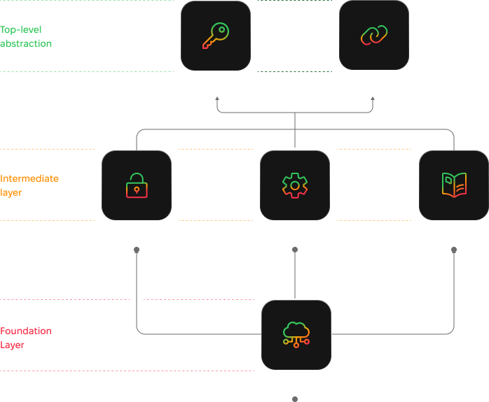

# 🌩️ Products

**Key Components of ThunderStack Bitcoin Native Infrastructure:**

1. **ThunderCloud**: A cloud-based node management solution offering 24/7 availability, no maintenance, and advanced security.
2. **ThunderEngine**: API-to-Cloud solution enabling seamless interaction with ThunderCloud services for efficient and scalable integrations.
3. **ThunderFlow**: Delivers inbound liquidity for RGB assets denominated channels and fee management..
4. **ThunderSafe**: A secure backup solution for encrypted user data with restoration through seed phrases.
5. **ThunderLink**: Ensures seamless interoperability between services and tools.
6. **ThunderCore SDK**: A comprehensive SDK combining ThunderEngine (Blockstream Grenlight like product), ThunderFlow(LSP), async payments, and remote signer functionalities.

## &#x20;ThunderStack Layered Architecture Overview

<figure><figcaption></figcaption></figure>
