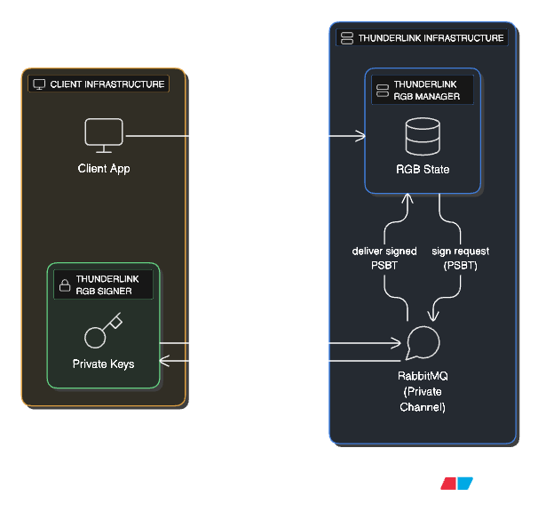

# Overwiew

**ThunderLink** is a **drop-in solution** for integrating **RGB asset transfers**. It offers a **simple HTTP REST API**, designed for **developer-friendliness** and **ease of integration** with **near-zero configuration**.

ThunderLink eliminates the complexity of handling RGB asset transactions, making it ideal for developers, businesses, and platforms looking to accept RGB transfers seamlessly.

## ThunderLink: Functional Design Description

ThunderLink is a plug-and-play integration layer for RGB assets on Bitcoin L1, aiming to be the “Stripe for RGB payments.” It enables businesses (exchanges, online merchants, etc.) to easily accept and manage RGB-based tokens with an experience similar to familiar payment gateways (Stripe, PayPal, Coinbase Commerce, CoinPayments). The system is composed of three main components working together:

* **ThunderLink RGB Manager** (managed by ThunderLink) – provides the core RGB asset functionality and APIs (invoice generation, state tracking, PSBT handling).\

* **ThunderLink RGB Signer** – is a lightweight service run by the customer (exchange or merchant) on their own infrastructure, holding their private keys and responsible for signing Bitcoin transactions (via PSBT). Communicating via RabbitMQ to listen for signing requests on a private channel, signing PSBTs sent by the ThunderLink RGB Manager, \

Target Users: The primary users are crypto exchanges (who can integrate ThunderLink for RGB token deposits & withdrawals) and RGB application developers or merchants who want to accept RGB asset payments in their apps or online stores. Secondary users include end-customers using an RGB-compatible wallet to make payments on these platforms.

<figure><figcaption></figcaption></figure>

### Architecture and Component Interaction

The ThunderLink architecture cleanly separates the concerns of asset logic, key management, and App interaction for better security and developer experience.

* The **Client App** communicates directly with the **ThunderLink RGB Manager** via REST API. \
  For security, it is strongly recommended that any UI-based client communicates with the ThunderLink RGB Manager through a customer-managed backend proxy rather than connecting directly. All API endpoints are protected by ThunderCloud Auth, and communication can be handled via direct API calls or an RPC interface using RabbitMQ. The Bitcoin Layer 1 network serves as the final settlement layer, and users can pay invoices using any RGB-compatible wallet.
* The **RGB Manager** handles asset logic but never holds private keys .
* When a transaction requires signing, the Manager sends a **signing request** to the **RGB Signer** using **RabbitMQ**.
* The **RGB Signer**, running securely in the customer’s environment, signs the PSBT and returns the result via the same message channel.
* The **Bitcoin L1 network** provides the settlement layer for finalizing transactions.
* **Users pay invoices using an RGB-compatible wallet** (e.g., mobile or desktop wallet that supports blinded UTXOs and RGB transfer formats).

\
