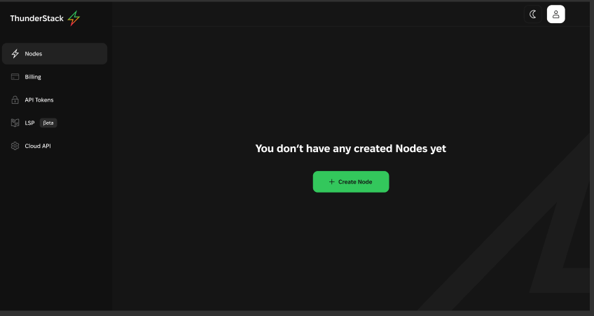

# ⚙️ Developer API

Users can use the generated access token to authenticate API requests. This token grants access to specified resources or actions, depending on the permissions it carries. \
The platform **does NOT store** the token itself for security reasons, only the metadata associated with the token such as its name, creation date, etc.

**Access Token Utilization for API Authorization:** Users can employ the access tokens generated on the platform to authorize interactions with two distinct types of APIs available.\
&#x20;\
`Authorization: Bearer {accessToken}` - This authorization header ensures that the API requests are securely authenticated. Follow this [article](../general/getting-started-with-thunderstack/create-api-token.md) to create `accessToken`

1. **Thunderstrack  API:**\
   [**https://cloud.thunderstack.org/docs**](https://cloud.thunderstack.org/docs)
2.  **RGB Lightning Node API**\
    [**https://cloud.thunderstack.org/rgb-docs**](https://cloud.thunderstack.org/rgb-docs)\
    \
    You can also access the RGB Lightning Node API through the UI. On node page select "Node API Docs" from the sidebar to view the node APIs.\

    <figure><figcaption></figcaption></figure>
