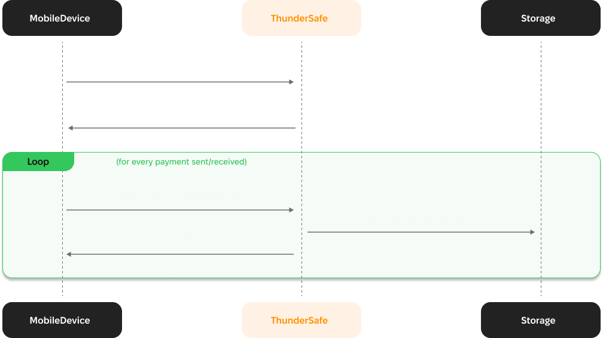
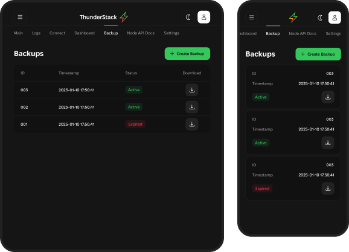
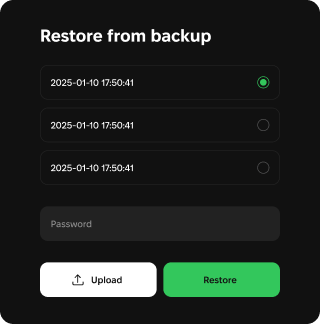

# ThunderSafe

**ThunderSafe**, a secure, trustless backup and recovery solution designed for Lightning Network and RGB assets. ThunderSafe provides encrypted cloud backups, multi-device synchronization, and seamless recovery, ensuring your funds and data remain safe and accessible at all times.

***

### Introduction

#### What is ThunderSafe?

ThunderSafe is a robust solution powered by a Versioned Storage Service (VSS) server. It offers:

* **Secure Backup:** Encrypt and store wallet data, RGB state, and transaction history.
* **Seamless Recovery:** Restore data easily in case of device loss or replacement.
* **Multi-Device Access:** Synchronize wallet data across multiple devices.

#### Why Choose ThunderSafe?

ThunderSafe is built with privacy and security at its core. Using client-side encryption, ThunderSafe ensures that only you have access to your keys and data, maintaining a trustless and non-custodial system.

***

## ThunderSafe High Level Data Flow

<figure><figcaption></figcaption></figure>

ThunderSafe offers server-side cloud storage solutions specifically tailored for non-custodial RGB supporting mobile wallets. First, it offers a cloud backup for (encrypted) RGB state (L1 & Liquid) and other wallet data that is crucial for recovery if the phone is lost or otherwise unavailable. Second, ThunderSafe enables support for multi-device access to the same wallet, handling the synchronization properly so the wallet doesn’t wind up in a confused state.

**Recovery:** In the event of a user losing their phone or access to their app's data, VSS allows for the restoration of the wallet state. This ensures that users can regain access to their funds, even in cases of device or data loss.

**Multi-device** Access: VSS enables multiple devices with the same wallet app to securely access and share LN state. This seamless switching between devices ensures consistent access to funds for users.

\

#### Key Features

1. **Encrypted Cloud Backups**
   * Automatically save your wallet data, including encrypted RGB state, ensuring recovery in case of phone loss or data unavailability.
2. **Multi-Device Synchronization**
   * Access the same wallet securely across multiple devices without risking data conflicts or confusion.
3. **Seamless Recovery**
   * Quickly restore wallet data on a new device, keeping your funds and transaction history intact.
4. **Privacy by Design**
   * ThunderSafe ensures non-custodial control, so only you have access to your keys and data.

***

### Getting Started

#### Steps to Use ThunderSafe

**1. Cloud Backups**

Automatically encrypt and save your wallet's RGB state and transaction data in the cloud for easy recovery.

<figure><figcaption></figcaption></figure>

**2. Multi-Device Synchronization**

Seamlessly synchronize your wallet data across multiple devices, ensuring consistent access to your funds.

<figure><figcaption></figcaption></figure>

**3. Secure Recovery**

Easily restore your wallet and its data in case of device loss or replacement.

<figure><figcaption></figcaption></figure>

***

#### Request Demo

Visit [Request Demo](https://www.thunderstack.org/?demo=true) to learn more about ThunderSafe’s capabilities.
